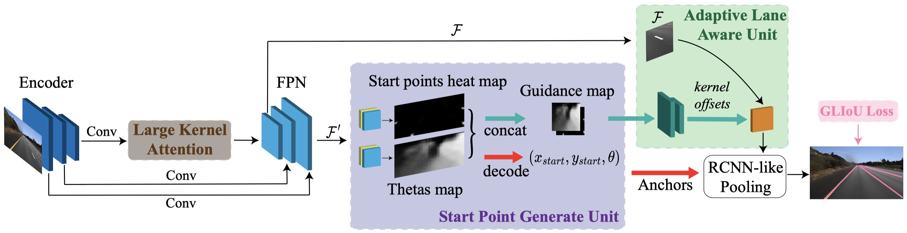
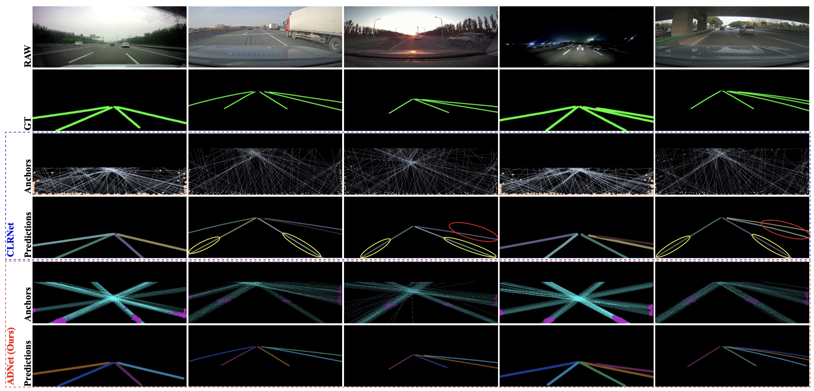
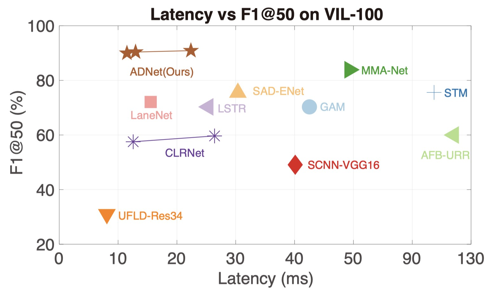

# ADNet: Lane Shape Prediction via Anchor Decomposition 

Pytorch implementation of the paper "ADNet: Lane Shape Prediction via Anchor Decomposition " (ICCV2023 Acceptance)

[[paper](https://arxiv.org/pdf/2308.10481.pdf)]
## Abstract
In this paper, we revisit the limitations of anchor-based lane detection methods, which have predominantly focused on fixed anchors that stem from the edges of the image, disregarding their versatility and quality. To overcome the inflexibility of anchors, we decompose them into learning the heat map of starting points and their associated directions. This decomposition removes the limitations on the starting point of anchors, making our algorithm adaptable to different lane types in various datasets. To enhance the quality of anchors, we introduce the Large Kernel Attention (LKA) for Feature Pyramid Network (FPN). This significantly increases the receptive field, which is crucial in capturing the sufficient context as lane lines typically run throughout the entire image. We have named our proposed system the Anchor Decomposition Network (ADNet). Additionally, we propose the General Lane IoU (GLIoU) loss, which significantly improves the performance of ADNet in complex scenarios. Experimental results on three widely used lane detection benchmarks, VIL-100, CULane, and TuSimple, demonstrate that our approach outperforms the state-of-the-art methods on VIL-100 and exhibits competitive accuracy on CULane and TuSimple.

## Environment setup
1. Clone this repository
```Shell
git clone https://github.com/Sephirex-X/ADNet.git
```
2. create conda environment if you using conda

```Shell
conda create -n ADNet && conda activate ADNet
```

   
3. install pytorch and Shapely

```Shell
conda install pytorch==1.12.1 torchvision==0.13.1 torchaudio==0.12.1 cudatoolkit=11.3 -c pytorch
```

```Shell
conda install Shapely==1.7.0
```

   
4. building independencies

```Shell
pip install -r requirements.txt
```

adding `-i https://pypi.tuna.tsinghua.edu.cn/simple` if you locate in China mainland.

   
5. setup everything

```Shell
python setup.py build develop
```

## Benchmarks setup

1. create folder under root path using

```Shell
mkdir data
```

2. organize structure like these:

```Shell
data/
├── CULane -> /mnt/data/xly/CULane/
├── tusimple -> /mnt/data/xly/tusimple/
└── VIL100 -> /mnt/data/xly/VIL100/
```

under each folder, you may see structure like this:

### CULane
Download [CULane](https://xingangpan.github.io/projects/CULane.html).
```
/mnt/data/xly/CULane/
├── driver_100_30frame
├── driver_161_90frame
├── driver_182_30frame
├── driver_193_90frame
├── driver_23_30frame
├── driver_37_30frame
├── laneseg_label_w16
└── list
```

### Tusimple
Download [Tusimple](https://github.com/TuSimple/tusimple-benchmark/issues/3).
```
/mnt/data/xly/tusimple/
├── clips
├── label_data_0313.json
├── label_data_0531.json
├── label_data_0601.json
├── test_label.json
└── test_tasks_0627.json

```

### VIL-100
Download [VIL-100](https://github.com/yujun0-0/mma-net).

You may find anno_txt here [anno_txt.zip](https://drive.google.com/file/d/1SizP9p0n-x-GhHmpYNyhMPBpPQgS3enI/view?usp=drive_link)
```Shell
/mnt/data/xly/VIL100/
├── Annotations
├── anno_txt
├── data
├── JPEGImages
└── Json
```

## Inferencing

1. You can inferencing model using: 

```Shell
python main.py {configs you want to use} --work_dirs {your folder} --load_from {your checkpoint path} --validate --gpus {device id}
```

for example:

```Shell
python main.py configs/adnet/tusimple/resnet18_tusimple.py --work_dirs test --load_from best_ckpt/tusimple/res18/best.pth --validate --gpus 3
```

If you don't assign `--work_dirs`, it will create folder named  `work_dirs` under root path by default.

2. By adding `--view` you can see visualization results under folder `vis_results`, under root path.

3. You can test fps using:

```Shell
python tools/fps_test.py
```

## Training (only support single gpu)

1. Simply using:

```Shell
python main.py {configs you want to use} --work_dirs {your folder} --gpus {device id}
```

2. You can resume from your last checkpoint by: 

```Shell
python main.py {configs you want to use} --work_dirs {your folder} --load_from {your checkpoint path} --gpus {device id}
```

3. Other hyperparameters can be changed within config files.

4. Your can check training procedure using tensorboard module:

   ```Shell
   tensorboard --logdir {your folder} --host=0.0.0.0 --port=1234
   ```
## Results


### VIL-100
|   Backbone  |   F1@50  | Acc |FP |FN |Download |
| :---        |   :---:  | :---:    | :---:    | :---:    | :---:    | 
| ResNet-18     |   89.97   | 94.23  |5.0   |5.1   |[Link](https://github.com/Sephirex-X/ADNet/releases/download/ckpt/vil_res18.pth) |
| ResNet-34     |   90.39   | 94.38   |4.4   |4.9   | [Link](https://github.com/Sephirex-X/ADNet/releases/download/ckpt/vil_res34.pth)  |
| ResNet-101     |   90.90   | 94.27   |4.7   |5.0   | [Link](https://github.com/Sephirex-X/ADNet/releases/download/ckpt/vil_res101.pth)  |

### CULane
|   Backbone  |   F1@50  | Download |
| :---  |     :---:    | :---:    | 
| ResNet-18     |   77.56   | [Link](https://github.com/Sephirex-X/ADNet/releases/download/ckpt/culane_res18.pth)  |
| ResNet-34     |   78.94   |  [Link](https://github.com/Sephirex-X/ADNet/releases/download/ckpt/culane_res34.pth)  |

### Tusimple

|   Backbone  |   F1@50  | Acc |FP |FN |Download |
| :---        |   :---:  | :---:    | :---:    | :---:    | :---:    | 
| ResNet-18     |   96.90   | 96.23  |2.91   |3.29   |[Link](https://github.com/Sephirex-X/ADNet/releases/download/ckpt/tusimple_res18.pth)  |
| ResNet-34     |   97.31   | 96.60   |2.83   |2.53   | [Link](https://github.com/Sephirex-X/ADNet/releases/download/ckpt/tusimple_res34.pth)  |


## Citation

If you find our work is useful, please consider citing:
```
@article{xiao2023adnet,
  title={ADNet: Lane Shape Prediction via Anchor Decomposition},
  author={Xiao, Lingyu and Li, Xiang and Yang, Sen and Yang, Wankou},
  journal={arXiv preprint arXiv:2308.10481},
  year={2023}
}
@InProceedings{Xiao_2023_ICCV,
    author    = {Xiao, Lingyu and Li, Xiang and Yang, Sen and Yang, Wankou},
    title     = {ADNet: Lane Shape Prediction via Anchor Decomposition},
    booktitle = {Proceedings of the IEEE/CVF International Conference on Computer Vision (ICCV)},
    month     = {October},
    year      = {2023},
    pages     = {6404-6413}
}
```
## Acknowledgement
<!--ts-->
* [open-mmlab/mmdetection](https://github.com/open-mmlab/mmdetection)
* [pytorch/vision](https://github.com/pytorch/vision)
* [Turoad/lanedet](https://github.com/Turoad/lanedet)
* [Turoad/CLRNet](https://github.com/Turoad/CLRNet)
* [lucastabelini/LaneATT](https://github.com/lucastabelini/LaneATT)
* [aliyun/conditional-lane-detection](https://github.com/aliyun/conditional-lane-detection)
<!--te-->
   
